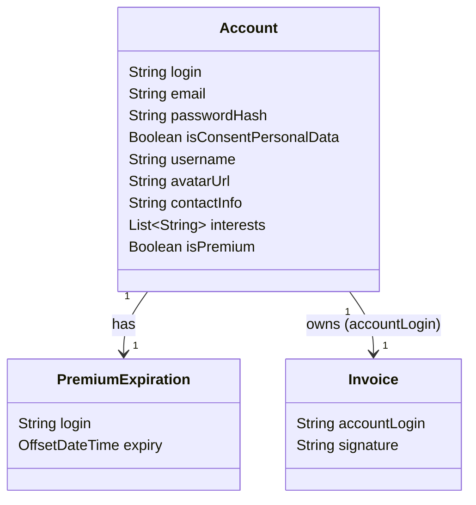
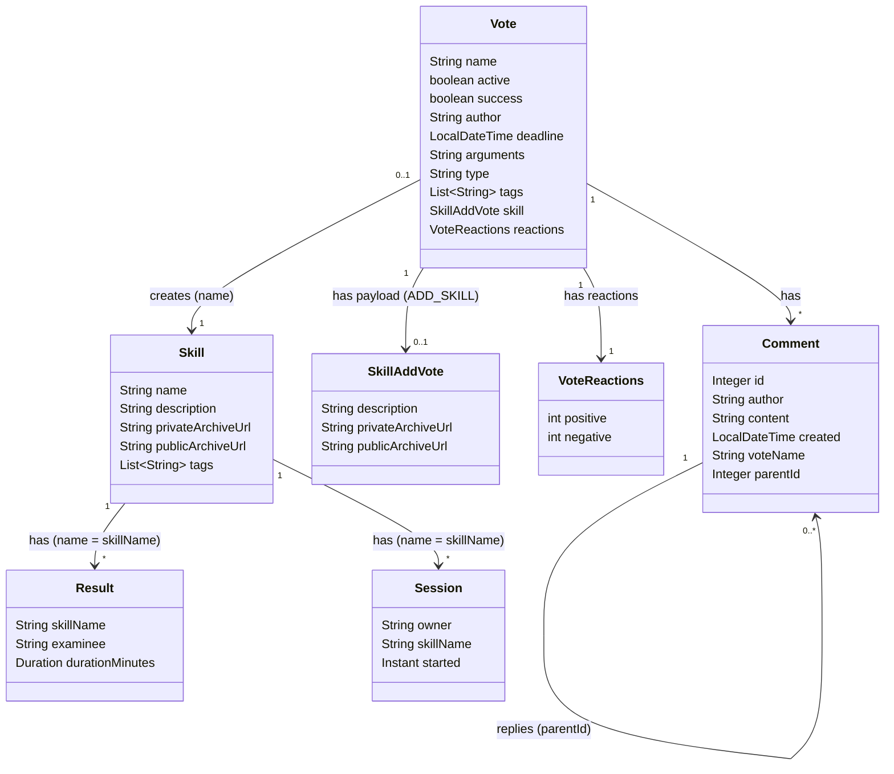
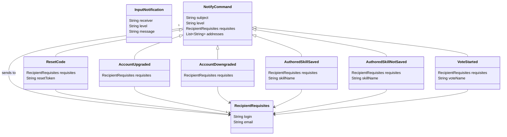
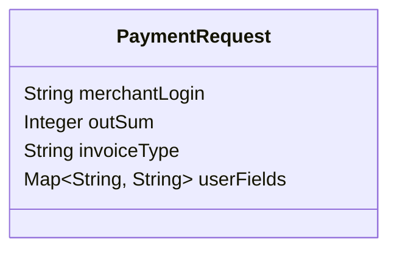
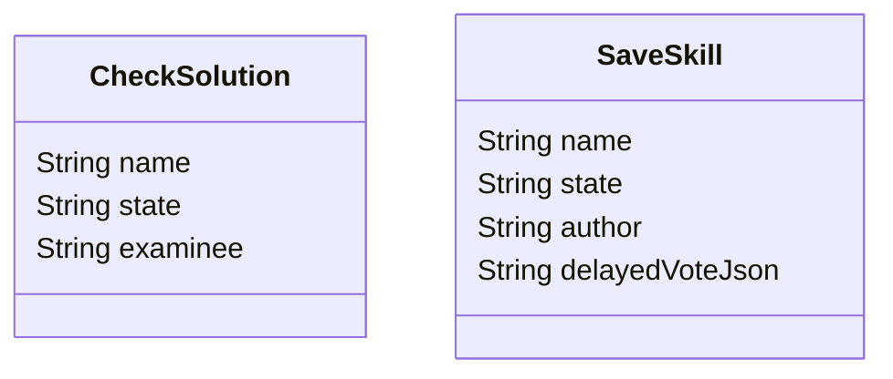
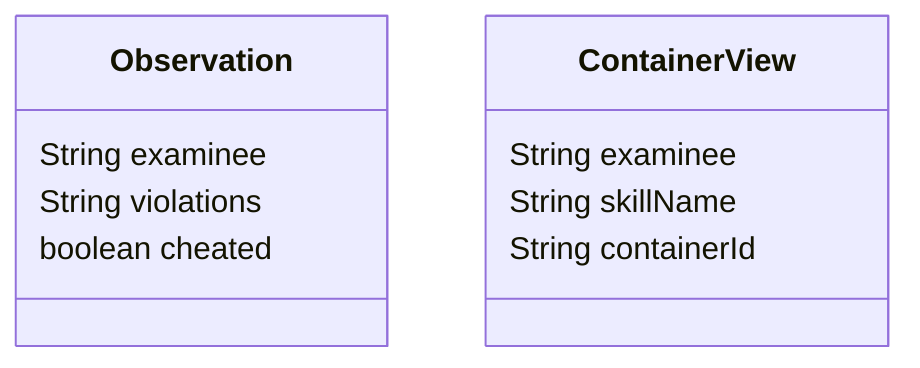

# Provve Backend

# Entities

TODO in the future, it will be separated into code and data parts

## 1. Accounts Domain

---

## 2. Skills Domain

---

## 3. Notifications Domain

---

## 4. Payments Domain

---

## 5. State Machine Domain

---

## 6. Validation Domain

